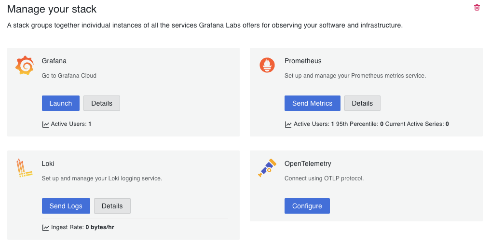
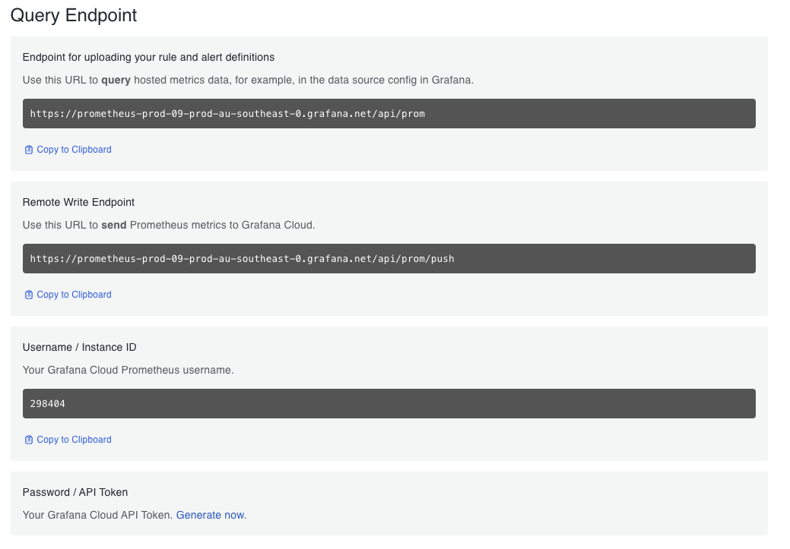
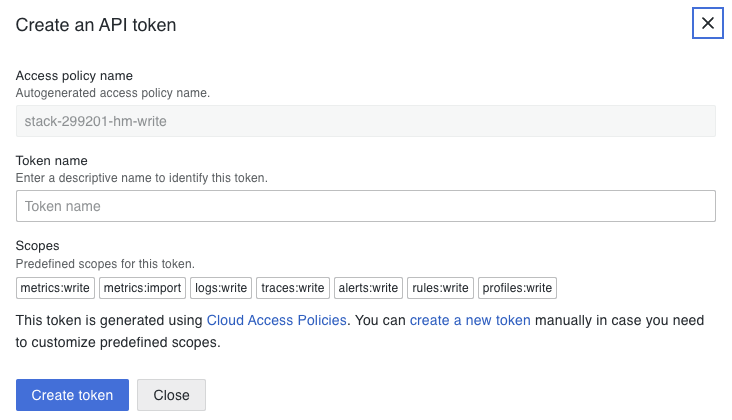

# How to push metrics to Grafana Cloud

You can create free Grafana Cloud here <https://grafana.com/auth/sign-up/create-user>

Under **Overview** `GRAFANA CLOUD`, you will find `Prometheus`.

Click on `Details`, you will find `Remove Write Endpoint` along will `Username /Instance ID` and `Password / API Token`.

Under `Password / API Token`, click on `Generate Now` to generate API Token.

