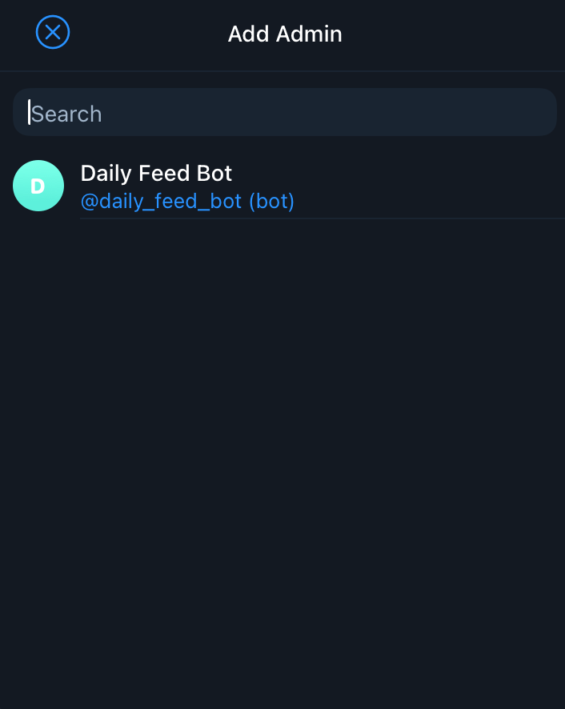
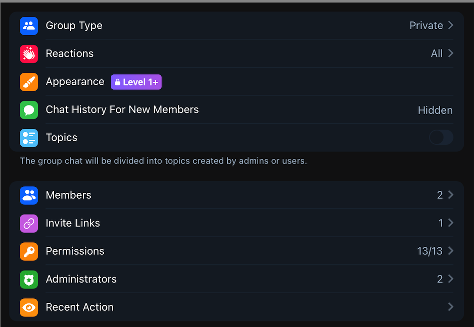

# How to create Telegram group and grant access to bot

1. Ref this doc to create Telegram Bot <https://core.telegram.org/bots/tutorial#obtain-your-bot-token>
2. Create Telegram group
3. Add bot to the created group
   - Edit group add add bot member

    

4. Grant bot admin access with permissions
   - Add bot with permissions by click on group title > **Edit** > **Administrators**

    

   - Select permissions

    
